# Entity Relationship Diagram

```mermaid
erDiagram
    users ||--o{ organizations : creates
    users ||--o{ org_memberships : joins
    organizations ||--o{ org_memberships : has
    users ||--o{ project_memberships : joins
    projects ||--o{ project_memberships : has
    organizations ||--o{ projects : owns
    projects ||--o{ retry_policies : defines
    projects ||--o{ queues : owns
    retry_policies o|--o{ queues : defaults
    queues ||--o{ capacity_tokens : limits
    queues ||--|| queue_rate_buckets : rate_limits
    queues ||--o{ jobs : contains
    queues ||--o{ scheduled_jobs : schedules
    projects ||--o{ batches : owns
    batches o|--o{ jobs : groups
    projects ||--o{ workflows : owns
    workflows o|--o{ jobs : groups
    jobs ||--o{ workflow_edges : parent
    jobs ||--o{ workflow_edges : child
    workflow_edges ||--o| edge_satisfaction : satisfies
    jobs ||--o{ job_executions : attempts
    jobs ||--o{ job_logs : logs
    jobs ||--o{ outbox_events : dispatches
    jobs ||--o{ dead_letter_entries : fails_to
    workers ||--o{ worker_heartbeats : reports
    workers ||--o{ job_executions : executes
    workers ||--o{ job_logs : emits
    workers o|--o{ capacity_tokens : holds
    scheduled_jobs ||--o{ scheduled_occurrences : fires
    scheduled_occurrences o|--o| jobs : creates
    dead_letter_entries ||--o| failure_summaries : summarizes
    users ||--o{ audit_log : performs

    users {
        uuid id PK
        string email UK
        string password_hash
        string display_name
        boolean is_active
        timestamp created_at
    }
    organizations {
        uuid id PK
        uuid created_by FK
        string name
        string slug UK
    }
    org_memberships {
        uuid id PK
        uuid org_id FK
        uuid user_id FK
        string role
    }
    projects {
        uuid id PK
        uuid org_id FK
        uuid created_by FK
        string name
        string slug
    }
    project_memberships {
        uuid id PK
        uuid project_id FK
        uuid user_id FK
        string role
    }
    retry_policies {
        uuid id PK
        uuid project_id FK
        string name
        integer max_attempts
        string strategy
        bigint base_delay_secs
        bigint max_delay_secs
    }
    queues {
        uuid id PK
        uuid project_id FK
        uuid retry_policy_id FK
        string name
        integer max_concurrency
        boolean is_paused
        integer rate_limit
        integer rate_window_secs
        integer shard_count
    }
    capacity_tokens {
        uuid id PK
        uuid queue_id FK
        uuid worker_id FK
        uuid job_id FK
        integer slot_index
        timestamp lease_until
        bigint epoch
    }
    queue_rate_buckets {
        uuid queue_id PK
        float tokens
        timestamp last_refill_at
    }
    batches {
        uuid id PK
        uuid project_id FK
        uuid queue_id FK
        string name
        integer total_jobs
        integer completed_jobs
        integer failed_jobs
        string status
    }
    workflows {
        uuid id PK
        uuid project_id FK
        string name
        string status
    }
    jobs {
        uuid id PK
        uuid queue_id FK
        integer shard_id
        uuid batch_id FK
        uuid workflow_id FK
        uuid token_id FK
        uuid lease_owner FK
        string type
        string status
        jsonb payload
        integer priority
        integer attempt
        integer max_attempts
        string idempotency_key UK
        bigint lease_epoch
        timestamp lease_expires_at
        timestamp scheduled_for
        timestamp next_retry_at
    }
    workflow_edges {
        uuid parent_id PK
        uuid child_id PK
        timestamp created_at
    }
    edge_satisfaction {
        uuid parent_id PK
        uuid child_id PK
        timestamp satisfied_at
    }
    job_executions {
        uuid id PK
        uuid job_id FK
        uuid worker_id FK
        integer attempt
        bigint lease_epoch
        string status
        timestamp started_at
        timestamp finished_at
    }
    job_logs {
        bigint id PK
        uuid job_id FK
        uuid execution_id FK
        uuid worker_id FK
        string level
        string message
        timestamp created_at
    }
    workers {
        uuid id PK
        string worker_name UK
        string hostname
        integer max_concurrency
        boolean is_active
        timestamp last_heartbeat_at
        timestamp stopped_at
    }
    worker_heartbeats {
        bigint id PK
        uuid worker_id FK
        integer running_jobs
        bigint processed_total
        bigint failed_total
        timestamp heartbeat_at
    }
    scheduled_jobs {
        uuid id PK
        uuid queue_id FK
        string name
        string job_type
        string cron_expr
        string timezone
        timestamp run_once_at
        timestamp next_fire_at
        boolean is_active
    }
    scheduled_occurrences {
        uuid scheduled_job_id PK
        timestamp fire_time PK
        uuid created_job_id FK
    }
    outbox_events {
        uuid id PK
        uuid job_id FK
        uuid queue_id
        uuid org_id
        uuid project_id
        string subject
        string nats_msg_id
        int publish_attempts
        timestamp published_at
        timestamp relay_locked_until
    }
    dead_letter_entries {
        uuid id PK
        uuid job_id FK
        uuid queue_id
        string reason
        integer attempt
        string final_error
        jsonb payload
        uuid replayed_to_job_id FK
        timestamp replayed_at
    }
    failure_summaries {
        uuid id PK
        uuid dlq_id FK
        uuid job_id FK
        string summary
        string remediation
        string model
    }
    audit_log {
        bigint id PK
        uuid actor_id FK
        uuid org_id
        string action
        string target
        jsonb details
        timestamp created_at
    }
    jobs_archive {
        uuid id PK
        uuid queue_id
    }
    job_executions_archive {
        uuid id PK
        uuid job_id
    }
    job_logs_archive {
        bigint id PK
        uuid job_id
    }
    dead_letter_entries_archive {
        uuid id PK
        uuid job_id
    }
```



## Keys and normalization

- Primary keys use UUIDs except append-only logs and heartbeats, which use
  `BIGSERIAL`. `scheduled_occurrences` and `workflow_edges` use composite keys.
- Foreign keys cascade only where the child has no independent audit value
  (for example project memberships and capacity tokens). Job history and DLQ
  rows restrict deletion so execution evidence is retained.
- Uniqueness constraints enforce case-insensitive user email, organization
  slug, worker name, queue name within a project, retry-policy name within a
  project, and a job's `(queue_id, idempotency_key)` pair.
- The schema is normalized to third normal form. Job retry settings are copied
  at enqueue time so later queue-policy edits do not alter in-flight work.

## Query-driven indexes

```sql
idx_jobs_queue_status      ON jobs(queue_id, status)
idx_jobs_queued            ON jobs(queue_id, priority DESC, created_at) WHERE status = 'QUEUED'
idx_jobs_retry             ON jobs(next_retry_at) WHERE status = 'RETRY_WAIT'
idx_jobs_scheduled         ON jobs(scheduled_for) WHERE status = 'SCHEDULED'
idx_jobs_waiting           ON jobs(queue_id) WHERE status = 'WAITING'
idx_jobs_queue_shard_status ON jobs(queue_id, shard_id, status)
idx_jobs_queue_created_at  ON jobs(queue_id, created_at DESC)
idx_executions_job_started ON job_executions(job_id, started_at DESC)
idx_logs_job_time          ON job_logs(job_id, created_at DESC)
idx_outbox_claim           ON outbox_events(priority DESC, created_at) WHERE published_at IS NULL
idx_outbox_job             ON outbox_events(job_id)
idx_scheduled_active_next  ON scheduled_jobs(next_fire_at) WHERE is_active
idx_audit_actor_time       ON audit_log(actor_id, created_at DESC)
```

The partial indexes keep queue-claim, retry, scheduler, and outbox scans small;
`SKIP LOCKED` and short transactions prevent competing workers from blocking
each other on hot paths.

## Lifecycle and cold storage

Job status vocabulary: `SCHEDULED → QUEUED → CLAIMED → RUNNING → COMPLETED`,
with `RETRY_WAIT` (bounded backoff), `WAITING` (workflow DAG gate),
`UNKNOWN_EXTERNAL_RESULT` (reconciler resolves after a grace period via the
`UNKNOWN_RESOLUTION_POLICY`), and terminal `FAILED` / `CANCELLED`. The state
machine is enforced in code (`validate_transition`) and mirrored by DB CHECK
constraints on `scheduled_jobs.job_type` / `workflows.status` (`NOT VALID`, so
legacy rows stay readable).

Cold path: terminal jobs older than `ARCHIVE_AFTER_DAYS` move — together with
their executions, logs, and *replayed* DLQ rows — into the four `*_archive`
twins (un-replayed DLQ entries are operational state and block archival).
Measured throughput: **~4,500 rows/s** with 500-row batches
(`db/tests/archive_bench.rs`). Heartbeats and job logs have independent
retention pruners; the scheduler runs all housekeeping each tick.
